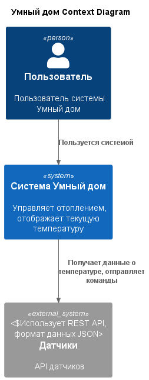
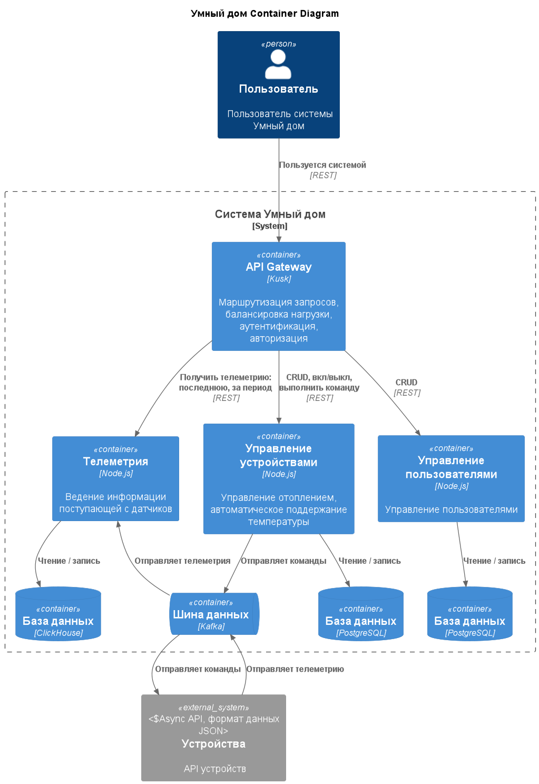
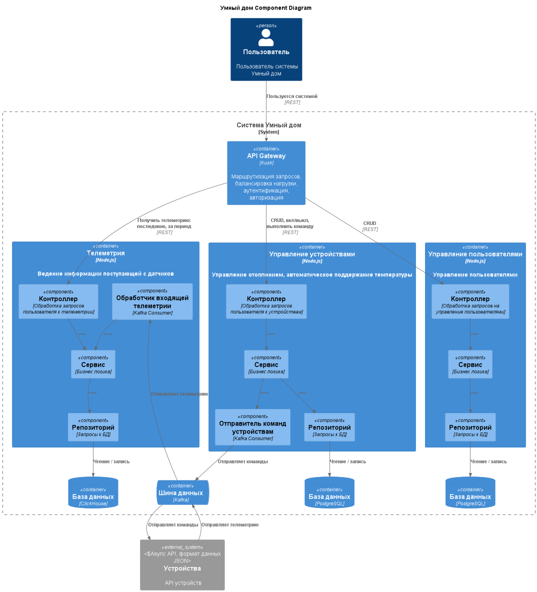
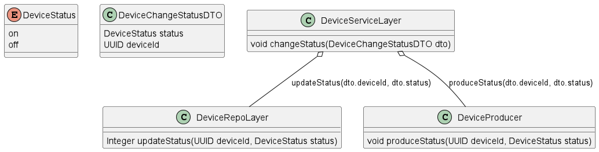
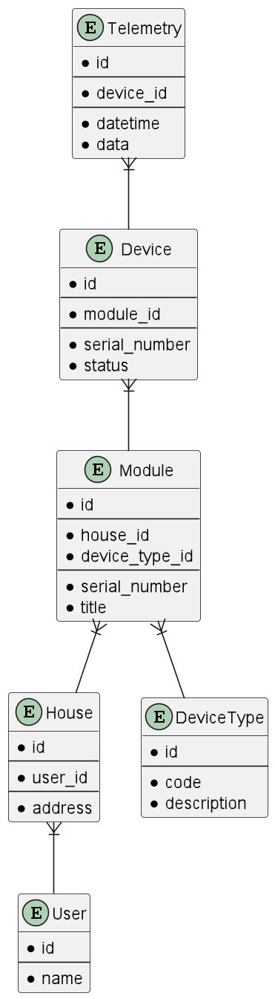

# Задание 1.1: Анализ и планирование

**1.1.1 Функциональность монолитного приложения:**

**Управление отоплением:**

* Пользователи могут удалённо включать/выключать отопление в своих домах.
* Пользователи могут устанавливать желаемую температуру.
* Система автоматически поддерживает заданную температуру, регулируя подачу тепла.

**Мониторинг температуры:**

* Система получает данные о температуре с датчиков, установленных в домах.
* Пользователи могут просматривать текущую температуру в своих домах через веб-интерфейс.

**1.1.2 Анализ архитектуры монолитного приложения**

* **Язык программирования**: Java. Популярный язык общего назначения. Много готовых решений, фреймворков, проверен временем.
* **База данных**: PostgreSQL. Реляционная БД. Соблюдает принципы ACID, но масштабируется только сторонними расширениями.
* **Архитектура**: Монолитная, все компоненты системы (обработка запросов, бизнес-логика, работа с данными) находятся в рамках одного приложения. Минусы: высокий риск ошибок (изменения в одной части приложения могут непредсказуемо влиять на другие части); длительные циклы разработки и развёртывания (при каждом изменении приходится тестировать всё приложение целиком); трудно масштабировать отдельные компоненты системы; трудно управлять командой.
* **Взаимодействие**: Синхронное, запросы обрабатываются последовательно. Плюсы: простота, предсказуемость, лёгкость отладки и мониторинга. Минусы: возможны высокие задержки, увеличение зависимости между сервисами, ограниченная масштабируемость из-за блокирующих вызовов.
* **Развертывание**: Требует остановки всего приложения. Пользователи могут сталкиваться с недоступностью на время развертывания.

**1.1.3 Домены и границы контекстов**

* **Домен: управление устройствами**

  * Поддомен: управление отоплением
    * Контекст: включение\выключение устройства
    * Контекст: установка необходимой температуры
  * Поддомен: автоматическое поддержание температуры
    * Контекст: регулировка подачи тепла

* **Домен: мониторинг температуры**

  * Поддомен: приём данных с датчиков
    * Контекст: получение данных с датчиков о температуре
  * Поддомен: отображение данных пользователю
    * Контекст: отображение текущей температуры в доме пользователя

**1.1.4 Визуализация контекста системы (С4 System Context diagram, PlantUML)**

[C4 диаграмма (System Context diagram), визуализирующая взаимодействие монолитного приложения с внешним миром](diagrams/context/SmartHome_Context.puml)



# Задание 1.2: Архитектура микросервисов
**1.2.1 Декомпозиция на микросервисы**
1. **Телеметрия** - микросервис, который занимается ведением информации поступающей с датчиков.
2. **Управление устройствами** - микросервис, занимается ведением перечня датчиков и отвечает за выполнение команд пользователя.
3. **Управления пользователями** - микросервис, который отвечает за управление пользователями и домовладениями.

**1.2.2 Определение взаимодействия**
1. Все запросы пользователя поступают в API Gateway.
2. API Gateway маршрутизирует запросы согласно роутингу микросервисам.
3. Микросервисы взаимодействуют с устройствами через модули. Модуль и микросервис общаются через шину данных (kafka).
4. Микросервисы хранят данные, которые заведены пользователями, и получены от устройств, в БД.

**1.2.3 Визуализация архитектуры**

[C4 — Уровень контейнеров (Containers)](diagrams/container/SmartHome_Container.puml)



[C4 — Уровень компонентов (Components)](diagrams/component/SmartHome_Component.puml)



Отобразим на диаграмме кода взаимодействие сервисного слоя со слоями БД и продюсером. Микросервис Управление устройствами. Смена статуса устройства.

[C4 — Уровень кода (Code)](diagrams/code/SmartHome_Code.puml)



# Задание 1.3: ER-диаграмма

**1.3.1 Идентификация сущностей**
* Пользователь (User)
* Дом (House)
* Устройство (Device)
* Тип устройства (DeviceType)
* Модуль (Module)
* Телеметрия (Telemetry)

**1.3.2 Определение атрибутов**

**Сущность "Дом (House)"**
* `id` — уникальный идентификатор дома.
* `user_id` — идентификатор пользователя — внешний ключ к таблице `User`.
* `address` — адрес дома.

**Сущность "Пользователь (User)"**
* `id` — уникальный идентификатор пользователя.
* `name` — имя пользователя.

**Сущность "Модуль (Module)"**
* `id` — уникальный идентификатор модуля.
* `house_id` — идентификатор дома, в котором установлен модуль — внешний ключ к таблице `House`.
* `device_type_id` — идентификатор типа устройства — внешний ключ к таблице `DeviceType`.
* `serial_number` — серийный номер модуля.
* `title` — название модуля.

**Сущность "Тип устройства (DeviceType)"**
* `id` — уникальный идентификатор типа устройства.
* `code` — код типа устройства.
* `description` — описание типа устройства.

**Сущность "Устройство (Device)"**
* `id` — уникальный идентификатор устройства.
* `module_id` — идентификатор модуля, к которому подключено устройство — внешний ключ к таблице `Module`.
* `serial_number` — серийный номер устройства.
* `status` — текущее состояние устройства (включено/выключено).

**Сущность "Телеметрия (Telemetry)"**
* `id` — уникальный идентификатор данных телеметрии.
* `device_id` — идентификатор устройства, который отправляет данные — внешний ключ к таблице `Device`.
* `datetime` — дата и время получения данных
* `data` — данные телеметрии

**1.3.3 Описание связей**

* **Пользователь — Дом:** один-ко-многим, один пользователь может иметь доступ к нескольким домам, но каждый дом связан только с одним пользователем.
* **Модуль — Дом:** один-ко-многим, в одном доме может быть установлено несколько модулей, но каждый модуль связан только с одним домом.
* **Модуль — Тип устройства:** один-ко-многим, один тип устройства может быть у нескольких модулей, но к одному модулю могут быть подключены устройства только одного типа.
* **Устройство — Модуль:** один-ко-многим, к одному модулю могут быть подключены несколько устройств, но каждое устройство связано только с одним модулем.
* **Телеметрия — Устройство:** один-ко-многим, одно устройство генерирует несколько единиц данных телеметрии, но одна единица данных может быть создана только одним устройством. 

**1.3.4 Построение ER-диаграммы**

[ER-диаграмма](diagrams/er/SmartHome_ER.puml)



****

# Базовая настройка

## Запуск minikube

[Инструкция по установке](https://minikube.sigs.k8s.io/docs/start/)

```bash
minikube start
```

## Добавление токена авторизации GitHub

[Получение токена](https://github.com/settings/tokens/new)

```bash
kubectl create secret docker-registry ghcr --docker-server=https://ghcr.io --docker-username=<github_username> --docker-password=<github_token> -n default
```

## Установка API GW kusk

[Install Kusk CLI](https://docs.kusk.io/getting-started/install-kusk-cli)

```bash
kusk cluster install
```

## Настройка terraform

[Установите Terraform](https://yandex.cloud/ru/docs/tutorials/infrastructure-management/terraform-quickstart#install-terraform)

Создайте файл ~/.terraformrc

```hcl
provider_installation {
  network_mirror {
    url = "https://terraform-mirror.yandexcloud.net/"
    include = ["registry.terraform.io/*/*"]
  }
  direct {
    exclude = ["registry.terraform.io/*/*"]
  }
}
```

## Применяем terraform конфигурацию

```bash
cd terraform
terraform apply
```

## Настройка API GW

```bash
kusk deploy -i api.yaml
```

## Проверяем работоспособность

```bash
kubectl port-forward svc/kusk-gateway-envoy-fleet -n kusk-system 8080:80
curl localhost:8080/hello
```

## Delete minikube

```bash
minikube delete
```
